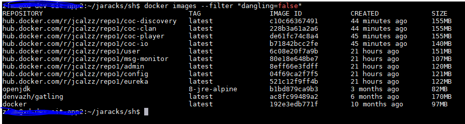
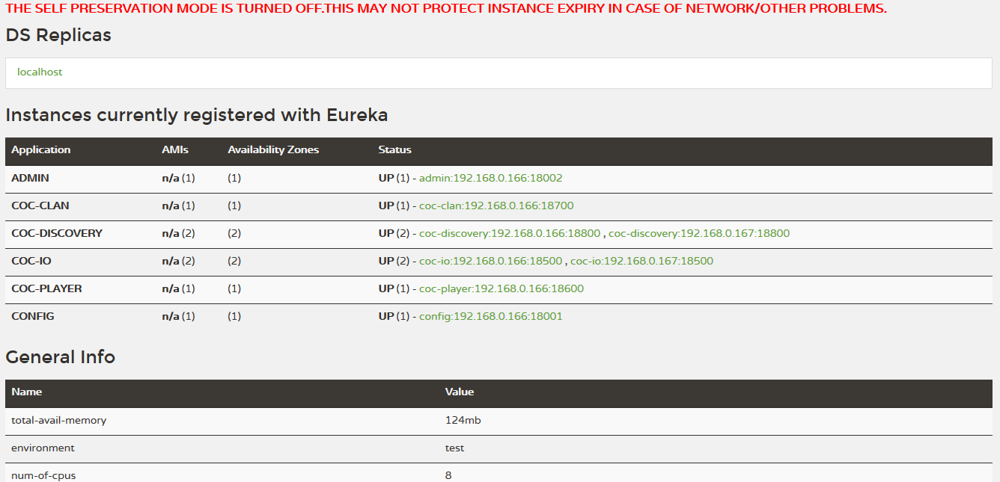
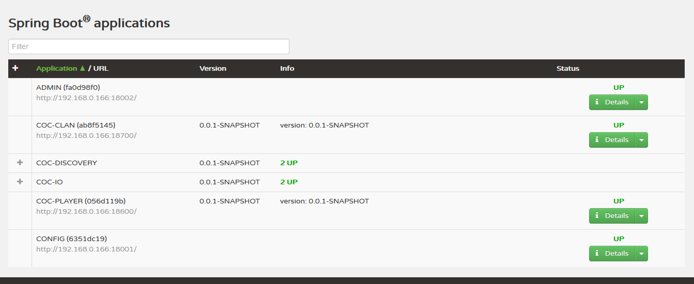
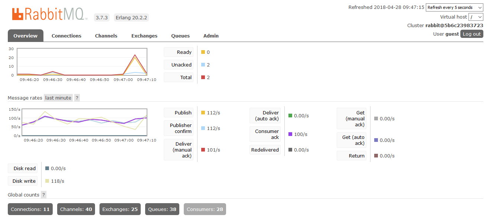

# Build

## install async-gamequery-lib
```
git clone https://github.com/John-Chan/async-gamequery-lib.git
cd async-gamequery-lib
git checkout -b coc-api-fix origin/coc-api-fix
mvn clean install
```

## checkout project
```
git clone --recursive https://github.com/shufork/coc-projects-aggregator.git
```

If your need update source code,run
```
git submodule update --recursive --remote
```

To build docker images,you need install docker first.
> see [Install Docker](https://docs.docker.com/install/) 

### For Windows

Run `build-docker-all.cmd` to build docker images,or run `build-jar-all.cmd` for jar packages.

### For Linux
```
chmod +x *.sh
```

Run `build-docker-all.sh` to build docker images,or run `build-jar-all.sh` for jar packages.


# Deploy


First,You need setup :
- Database for service (checkout application.yml for each serivce) 
- Git repository to host configuration files,config file templates: `\system\config\src\main\resources\config`


### docker( minimize )
`minimize` means single instance for all service

see shell script in `it-ops/mini/linux-docker`.

# Test

- rabbit mq management: http://your-ip-address:15672.(default user/password :guest/guest)
- eureka : http://your-ip-address:8761/
- admin(Spring Boot) : http://your-ip-address:18002/
- swagger ui: http://your-ip-address:service-port/swagger-ui.html

# screen









# NOTE: 

- No front end (web server) currently
- So,What does this program do?download game data,lots of data,then find something fun.


